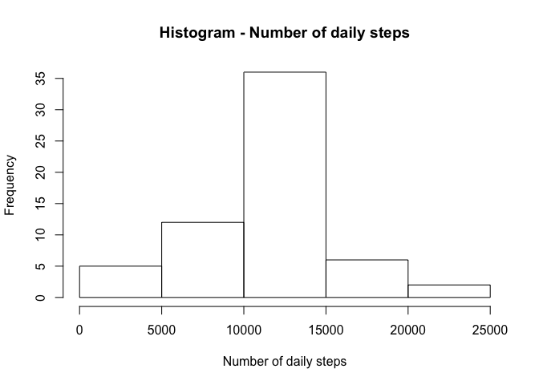
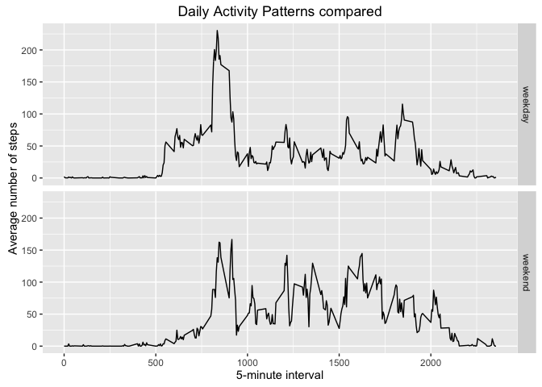

# Reproducible Research: Peer Assessment 1

author : Gerrit Versteeg

date   : Oct 14th, 2016


## Loading and preprocessing the data

Because the dataset (in ZIP-format) is already in the contents of the forked
repo, we do not have to download the file again.  
_Note: the original data was downloaded in RPeng's Repo on Feb 11th, 2014._  

First step to take is unzipping 'activity.zip' into a ./data directory and then
read the resulting 'activity.csv' into a dataset called 'DF-raw' using dplyr. 
A peek of the content is shown.


```r
library("dplyr", warn.conflicts=FALSE)             ## load dplyr silently
if (file.exists("./data/activity.csv")) {          ## check if file exists
        unlink("./data/activity.csv")              ## if so -> delete 
}
unzip("./activity.zip", exdir = "./data")          ## unzip into data dir
DF_raw <- tbl_df(read.csv("./data/activity.csv"))  ## load into a dataset
DF_raw                                             ## and take a peek
```

```
## # A tibble: 17,568 x 3
##    steps       date interval
##    <int>     <fctr>    <int>
## 1     NA 2012-10-01        0
## 2     NA 2012-10-01        5
## 3     NA 2012-10-01       10
## 4     NA 2012-10-01       15
## 5     NA 2012-10-01       20
## 6     NA 2012-10-01       25
## 7     NA 2012-10-01       30
## 8     NA 2012-10-01       35
## 9     NA 2012-10-01       40
## 10    NA 2012-10-01       45
## # ... with 17,558 more rows
```

Next step is to pre-process the data for analysis. Obviously the date is 
formatted as factor, inhibiting processing in weekdays and weekend later on.
So we need to reformat that variable to the 'Date' format. 


```r
DF_raw$date <- as.Date(strptime(DF_raw$date, "%Y-%m-%d"))  ## reformat to date
class(DF_raw$date)                                         ## show class
```

```
## [1] "Date"
```


## What is mean total number of steps taken per day?

First we calculate the total number of steps taken each day. Using dplyr we
group the dataset by date and sum the steps into a column named 'total'.


```r
DF_tsd <-                                    ## dplyr-code to create DF-tsd
        DF_raw %>%                           ## use DF-raw to
        select(steps, date) %>%              ## select relevant columns
        group_by(date) %>%                   ## group them by date
        summarize(total = sum(steps)) %>%    ## calculate the sum of steps
        print()                              ## and take a peek
```

```
## # A tibble: 61 x 2
##          date total
##        <date> <int>
## 1  2012-10-01    NA
## 2  2012-10-02   126
## 3  2012-10-03 11352
## 4  2012-10-04 12116
## 5  2012-10-05 13294
## 6  2012-10-06 15420
## 7  2012-10-07 11015
## 8  2012-10-08    NA
## 9  2012-10-09 12811
## 10 2012-10-10  9900
## # ... with 51 more rows
```

Note: you can see that there are days with no observations at all.


Now let's plot a histogram of the frequency of the number of steps taken daily 
to get an idea of the most frequent values.


```r
with(DF_tsd, hist(total,                              ## freq. daily steps
     main = "Histogram - Number of daily steps",      ## set main title
     xlab = "Number of daily steps",                  ## set label X-axis
     ylab = "Frequency"))                             ## set label Y-axis
```

<!-- -->

Apparently the most frequent number of daily steps lies between **10k and 15k** 
steps per day.

Finally we need to take a look at the mean and the median of the 
daily total of steps. Using summary will automatically separate the NA's and
show us some more info.


```r
sum_raw <- as.integer(summary(DF_tsd$total))  ## store for later comparison
summary(DF_tsd$total)                         ## show summary with mean & median
```

```
##    Min. 1st Qu.  Median    Mean 3rd Qu.    Max.    NA's 
##      41    8841   10760   10770   13290   21190       8
```

Obviously the mean of all daily steps appears to be **10.770** steps per day,
while the median is **10.760** steps/day. Also visible is the fact that there are
8 days with no step registration at all.


## What is the average daily activity pattern?
Now we want to take a look at the daily activity pattern using the average
number of steps taken in each time interval. Looking at the variable 'interval'
we see that the intervals vary from 0 (00:00-04:59) up to 2355 (23:55-23:59).
These 288 (60*24/5) values will be the time-series used for the activity
pattern, while we compute the mean of the daily number of steps for each of
these intervals (ignoring any NA-values). 


```r
DF_dap <-                                    ## dplyr-code to create DF-dap
        DF_raw %>%                           ## use DF-raw to
        select(steps, interval) %>%          ## select relevant columns
        group_by(interval) %>%               ## group them by interval
        summarize(avg = mean(steps,          ## calculate the mean of the
                  na.rm = TRUE)) %>%         ## interval across days
        print()                              ## and take a peek
```

```
## # A tibble: 288 x 2
##    interval       avg
##       <int>     <dbl>
## 1         0 1.7169811
## 2         5 0.3396226
## 3        10 0.1320755
## 4        15 0.1509434
## 5        20 0.0754717
## 6        25 2.0943396
## 7        30 0.5283019
## 8        35 0.8679245
## 9        40 0.0000000
## 10       45 1.4716981
## # ... with 278 more rows
```

Asc an be expected, there is not much activity going on just after midnight.


Now for the activity pattern of an average day, let's plot this as a time-series,
showing the average (across days) of steps taken during each specific interval. 


```r
with(DF_dap, plot(interval, avg,             ## plot DF_dap (avg.steps˜interval)
     type ="l",                              ## using a line-plot
     main = "Daily Activity Pattern",        ## set main title
     xlab = "5-minute interval",             ## set label X-axis
     ylab = "Average number of steps"))      ## set label Y-axis
```

<!-- -->

Looking at the resulting pattern, there seems to be a clear peak in the morning
(over **200** steps in 5-minutes). This might indicate a morning run or walk
each day prior to going to work.  
Because we like to see in which specific interval this peak lies exactly, 
we select and print the row where 'average' equals the maximum value.


```r
filter(DF_dap, avg == max(avg))  ## select row of interval with max # of steps
```

```
## # A tibble: 1 x 2
##   interval      avg
##      <int>    <dbl>
## 1      835 206.1698
```

The result shows that interval **835** (08:35-08:39) contains the highest number of
steps averaged across days. Namely roughly **206** steps. 


## Imputing missing values
Some of the measures are missing, in other words; during some intervals or
even days, the steps taken were not registered. These missing measurements are 
noted as NA's. Let's first look at the number of missing values (NA's).


```r
sum(is.na(DF_raw$steps))        ## calculate NA's in Steps variable
```

```
## [1] 2304
```

Apparently there are **2304** missing values. Just to be sure that NA's only
occur in de steps variable, we will check the NA-count over all variables in
the dataset.


```r
sum(is.na(DF_raw))              ## calculate NA's in complete dataframe
```

```
## [1] 2304
```

Clearly the number of NA's in the complete dataset is the same as the number
of NA's in de steps variable (i.e. 2304). Therefor NA's only occurr in the
variable 'steps'.

####Imputing strategy
What will be the replacements for missing values?. Looking at the distribution 
with the peak around 8:30, replacement of NA's with the mean of a complete day
would ruin the pattern and because in some cases complete days are missing would
result in an additional NA.  
A better solution seems to be to impute values that coincide with the mean of 
that specific interval. This will retain the activity pattern across the day.


When imputing the missing values, we need to do that with the mean of the 
interval at hand. Using dplyr's mutate to replace the NA with 'mean(steps')
would result in the mean of all steps in the dataframe, if we leave the dataset
as is. To fill it with the means per interval, we first group the dataset using
group_by(interval). Calling mean(steps) will now return the mean for the interval
rather than the overall mean. After determining the mean, we remove the grouping
because the resulting dataset does not need grouping per interval.


```r
DF_nas <-                                     ## create new dataset
        DF_raw %>%                            ## derived from DF_raw
        group_by(interval) %>%                ## grouped to get mean/interval
        mutate(steps = ifelse(is.na(steps),   ## replace steps if value is NA
        as.integer(mean(steps, na.rm=TRUE)),  ## with the mean of the interval
        steps)) %>%                           ## or leave steps alone.
        group_by() %>%                        ## Remove the interval grouping
        print                                 ## and take a peek
```

```
## # A tibble: 17,568 x 3
##    steps       date interval
##    <int>     <date>    <int>
## 1      1 2012-10-01        0
## 2      0 2012-10-01        5
## 3      0 2012-10-01       10
## 4      0 2012-10-01       15
## 5      0 2012-10-01       20
## 6      2 2012-10-01       25
## 7      0 2012-10-01       30
## 8      0 2012-10-01       35
## 9      0 2012-10-01       40
## 10     1 2012-10-01       45
## # ... with 17,558 more rows
```

We can see that the NA's are replaced by the interval means.


Next we recalculate the total number of steps taken each day. Using dplyr we
group the dataset by date and sum the steps into a column named 'total'.


```r
DF_tsdnas <-                                 ## dplyr-code to create DF-tsdnas
        DF_nas %>%                           ## use DF-nas to
        select(steps, date) %>%              ## select relevant columns
        group_by(date) %>%                   ## group them by date
        summarize(total = sum(steps)) %>%    ## calculate the sum of steps
        print()                              ## and take a peek
```

```
## # A tibble: 61 x 2
##          date total
##        <date> <int>
## 1  2012-10-01 10641
## 2  2012-10-02   126
## 3  2012-10-03 11352
## 4  2012-10-04 12116
## 5  2012-10-05 13294
## 6  2012-10-06 15420
## 7  2012-10-07 11015
## 8  2012-10-08 10641
## 9  2012-10-09 12811
## 10 2012-10-10  9900
## # ... with 51 more rows
```

Now let's regenerate the histogram of the frequency of the number of steps taken
daily to get an idea of the change in the most frequent values.


```r
with(DF_tsdnas, hist(total,                           ## freq. daily steps
     main = "Histogram - Number of daily steps",      ## set main title
     xlab = "Number of daily steps",                  ## set label X-axis
     ylab = "Frequency"))                             ## set label Y-axis
```

<!-- -->

Apparently the most frequent number of daily steps still lies between **10k and 
15k** steps per day, but the number of observations between 10k and 15k has risen
from approx. **28** to approx. **36**. Imputing NA's with the interval mean 
apparantly tightened the number of daily steps towards the mean, as can be 
expected.

Finally we need to take a another look at the mean and the median of the 
daily total of steps, again using summary.


```r
sum_nas <- as.integer(summary(DF_tsdnas$total)) ## store for comparison
summary(DF_tsdnas$total)                        ## show summary for mean/median
```

```
##    Min. 1st Qu.  Median    Mean 3rd Qu.    Max. 
##      41    9819   10640   10750   12810   21190
```

The new mean is **10.750** steps/day, while the new median adds up to **10.640*
steps/day.

Comparing the results:

|   | Min | Median | Mean |  Max  | NAs |
|----|----|----|----|----|----|
| Original |41 |10760 |10770 |21190 |8 |
| Imputed  |41 |10640 |10750 |21190 | |

After imputing the interval mean, obviously the mean of all daily steps appears 
to have changed from 10.770 to 10.750 steps per day, while the median changed
from 10.760 to 10.640 steps/day. Apparantly the imputed values are lower than
the original mean and therefore drag down the mean. No NA's remain now.

## Are there differences in activity patterns between weekdays and weekends?

To be able to distinguish between weekdays and weekend days, we need to add
another variable 'ww' to the dataset DF_nas (note: this is the dataset with the 
imputed values). Using the weekdays function on the variable 'date'
(that was reformated into date whilst cleaning the data at the start) 
we will check to see whether the data is a 'saturday' or a 'sunday". If so,
we set 'ww' to 'weekend' otherwise to 'weekday'.


While we're at it, we next group the dataset on 'ww' and 'interval' because we
now need to calculate the mean number of daily steps for each type of day
(weekday or weekend) **and** for each interval across all days.


```r
WE <- c("Saturday", "Sunday")
DF_nasw <-                                   ## dplyr-code to create DF-nasw
        DF_nas %>%                           ## use DF-nas to
        mutate(ww = ifelse(weekdays(date)    ## add a column 'ww'
                           %in% WE,          ## check if weekday = Sat or Sun
                           "weekend",        ## then fill it with "weekend"
                           "weekday")) %>%   ## else fill it with "weekday"
        print                                ## and take a peek
```

```
## # A tibble: 17,568 x 4
##    steps       date interval      ww
##    <int>     <date>    <int>   <chr>
## 1      1 2012-10-01        0 weekday
## 2      0 2012-10-01        5 weekday
## 3      0 2012-10-01       10 weekday
## 4      0 2012-10-01       15 weekday
## 5      0 2012-10-01       20 weekday
## 6      2 2012-10-01       25 weekday
## 7      0 2012-10-01       30 weekday
## 8      0 2012-10-01       35 weekday
## 9      0 2012-10-01       40 weekday
## 10     1 2012-10-01       45 weekday
## # ... with 17,558 more rows
```

```r
DF_dapw <-                                   ## dplyr-code to create DF-dapw
        DF_nasw %>%                          ## use DF-nasw to
        select(steps, interval, ww) %>%      ## select the relevant columns
        group_by(ww, interval) %>%           ## group them by ww & interval
        summarize(avg = mean(steps, 
                  na.rm = TRUE)) %>%         ## calculate the mean across days
        print                                ## and take a peek
```

```
## Source: local data frame [576 x 3]
## Groups: ww [?]
## 
##         ww interval        avg
##      <chr>    <int>      <dbl>
## 1  weekday        0 2.15555556
## 2  weekday        5 0.40000000
## 3  weekday       10 0.15555556
## 4  weekday       15 0.17777778
## 5  weekday       20 0.08888889
## 6  weekday       25 1.57777778
## 7  weekday       30 0.62222222
## 8  weekday       35 1.02222222
## 9  weekday       40 0.00000000
## 10 weekday       45 1.73333333
## # ... with 566 more rows
```

Now that we have the dataset that we need, we can start to plot this
as a time-series in two frames (one for weekend and onde for weekdays), showing
the average (across days) of steps taken during each specific interval of these
two types of days. 

*Please note that I use ggplot2 for this plot, because I like the way it shows
multiple facets. This differs a bit from the example plot given by our mentor. 
He stated that is not needed to reproduce the figure exactly as is. As long as
the comparison is facilitated in roughly the same manner. So I hope you don't
mind*


```r
library(ggplot2)
g <- ggplot(DF_dapw, aes(interval, avg))             ## setup graphic object for ggplot
g+geom_path()+                                       ## plot the path
        facet_grid(ww~.) +                           ## setup the grid (2 rows x 1 column)
        xlab("5-minute interval") +                  ## label X-axis
        ylab("Average number of steps") +            ## label Y-axis
        ggtitle("Daily Activity Patterns compared")
```

<!-- -->

Activity appears to start **earlier** in weekdays (around 05:00) than in weekends
(around 07:30). The **'workout' pattern** is still visible during weekdays, refering
to the peak around 8:30 followed by lower activity during the remainder of the
day. While during weekends, activity is **spread more evenly** across the day.

