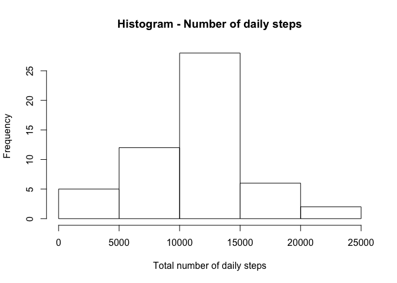
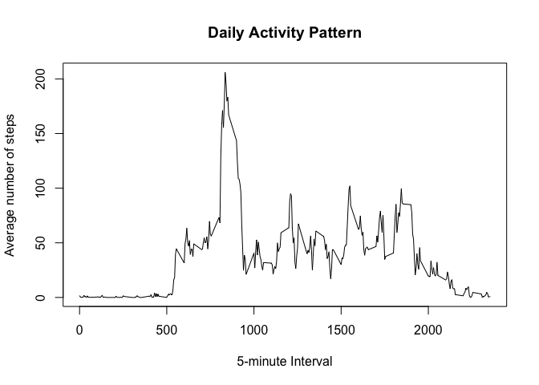

# Reproducible Research: Peer Assessment 1

author : Gerrit Versteeg

date   : Oct 12th, 2016


## Loading and preprocessing the data

Because the dataset (in ZIP-format) is already in the contents of the forked
repo, we do not have to download the file again.  
_Note: the original data was downloaded in RPeng's Repo on Feb 11th, 2014._  

First step to take is unzipping 'activity.zip' into a ./data directory and then
read the resulting 'activity.csv' into a tibble called 'DF-raw' using dplyr. 
A peek of the content is shown.


```r
library("dplyr", warn.conflicts=FALSE)
if (file.exists("./data/activity.csv")) {
        unlink("./data/activity.csv")
}
unzip("./activity.zip", exdir = "./data")
DF_raw <- tbl_df(read.csv("./data/activity.csv"))
DF_raw
```

```
## # A tibble: 17,568 x 3
##    steps       date interval
##    <int>     <fctr>    <int>
## 1     NA 2012-10-01        0
## 2     NA 2012-10-01        5
## 3     NA 2012-10-01       10
## 4     NA 2012-10-01       15
## 5     NA 2012-10-01       20
## 6     NA 2012-10-01       25
## 7     NA 2012-10-01       30
## 8     NA 2012-10-01       35
## 9     NA 2012-10-01       40
## 10    NA 2012-10-01       45
## # ... with 17,558 more rows
```

Next step is to pre-process the data for analysis. Obviously the date is 
formatted as factor, inhibiting processing in weekdays and weekend. So we need
to reformat that variable to the 'Date' format. 


```r
DF_raw$date <- as.Date(strptime(DF_raw$date, "%Y-%m-%d"))
class(DF_raw$date)
```

```
## [1] "Date"
```


## What is mean total number of steps taken per day?

First we calculate the total number of steps taken each day. Using dplyr we
group the tibble by date and sum the steps into a column named 'total'.


```r
DF_tsd <-                                    ## dplyr-code to create DF-tsd
        DF_raw %>%                           ## use DF-raw to
        select(steps, date) %>%              ## select relevant columns
        group_by(date) %>%                   ## group them by date
        summarize(total = sum(steps)) %>%    ## calculate the sum of steps
        print()                              ## and take a peek
```

```
## # A tibble: 61 x 2
##          date total
##        <date> <int>
## 1  2012-10-01    NA
## 2  2012-10-02   126
## 3  2012-10-03 11352
## 4  2012-10-04 12116
## 5  2012-10-05 13294
## 6  2012-10-06 15420
## 7  2012-10-07 11015
## 8  2012-10-08    NA
## 9  2012-10-09 12811
## 10 2012-10-10  9900
## # ... with 51 more rows
```

Now let's plot a histogram of the frequency of the number of steps taken daily 
to get an idea of the most frequent values.


```r
with(DF_tsd, hist(total,                              ## freq. daily steps
     main = "Histogram - Number of daily steps",      ## set main title
     xlab = "Number of daily steps",                  ## set label X-axis
     ylab = "Frequency"))                             ## set label Y-axis
```

<!-- -->

Apparently the most frequent number of daily steps lies between 10k and 15k 
steps per day.

Finally we need to take a look at the mean and the median of the 
daily total of steps. Using summary will automatically separate the NA's and
show us some more info.


```r
summary(DF_tsd$total)
```

```
##    Min. 1st Qu.  Median    Mean 3rd Qu.    Max.    NA's 
##      41    8841   10760   10770   13290   21190       8
```

Obviously the mean of all daily steps appears to be 10.770 steps per day,
while the median is 10.760 steps/day. Also visible is the fact that there are
8 days with no step registration at all.


## What is the average daily activity pattern?
Now we want to take a look at the daily activity pattern using the average
number of steps taken in each time interval. Looging at the variable 'interval'
we see that the intervals vary from 0 (00:00-04:59) up to 2355 (23:55-23:59).
These 288 (60*24/5) values will be the time-series used for the activity
pattern, while we compute the mean of the daily number of steps for each these
intervals (ignoring any NA-values). 


```r
DF_dap <-                                    ## dplyr-code to create DF-dap
        DF_raw %>%                           ## use DF-raw to
        select(steps, interval) %>%          ## select relevant columns
        group_by(interval) %>%               ## group them by interval
        summarize(avg = mean(steps, 
                  na.rm = TRUE)) %>%         ## calculate the mean across days
        print()                              ## and take a peek
```

```
## # A tibble: 288 x 2
##    interval       avg
##       <int>     <dbl>
## 1         0 1.7169811
## 2         5 0.3396226
## 3        10 0.1320755
## 4        15 0.1509434
## 5        20 0.0754717
## 6        25 2.0943396
## 7        30 0.5283019
## 8        35 0.8679245
## 9        40 0.0000000
## 10       45 1.4716981
## # ... with 278 more rows
```

Now let's plot this as time-series, showing the average (across days) of 
steps taken during each specific interval of a day. 


```r
with(DF_dap, plot(interval, avg,             ## plot DF_dap (avg.steps˜interval)
     type ="l",                              ## using a line-plot
     main = "Daily Activity Pattern",        ## set main title
     xlab = "5-minute interval",             ## set label X-axis
     ylab = "Average number of steps"))      ## set label Y-axis
```

<!-- -->

Looking at the resulting pattern, there seems to be a clear peak in the morning,
that might indicate a morning run or walk each day prior to going to work. 
If we like to see in which specific interval the peak lies, we select and print 
the row where the average equals the maximum value.


```r
filter(DF_dap, avg == max(avg))
```

```
## # A tibble: 1 x 2
##   interval      avg
##      <int>    <dbl>
## 1      835 206.1698
```

The result shows that interval 835 (08:35-08:39) contains the highest number of
steps averaged across days. Namely roughly 206 steps. 


## Imputing missing values


## Are there differences in activity patterns between weekdays and weekends?
